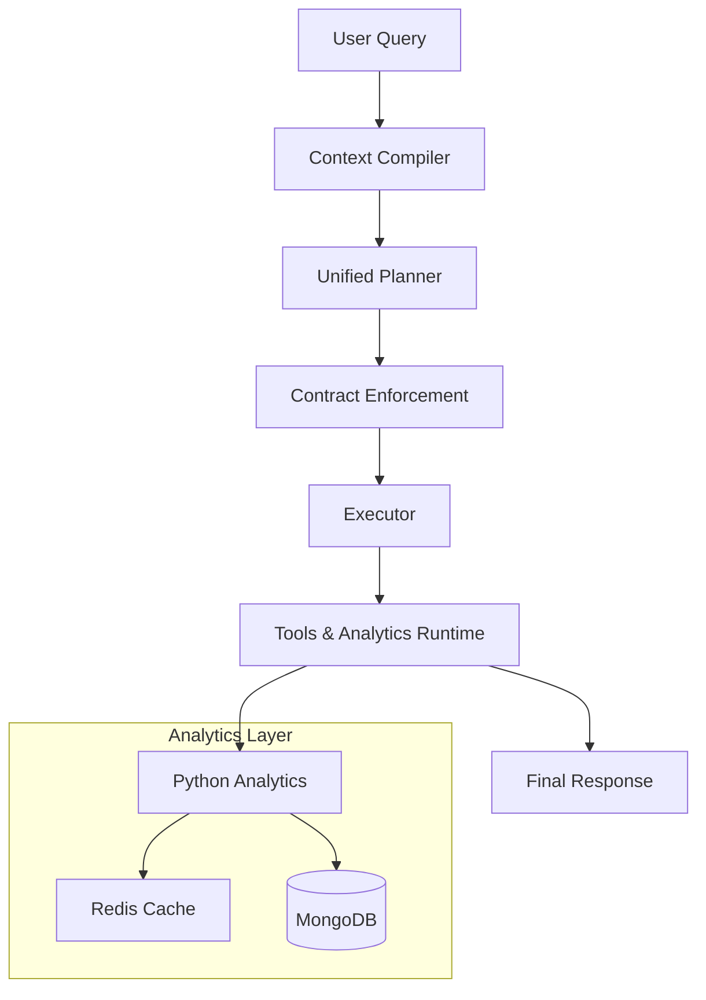
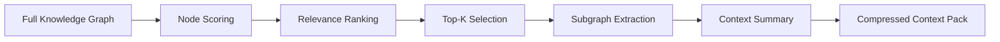
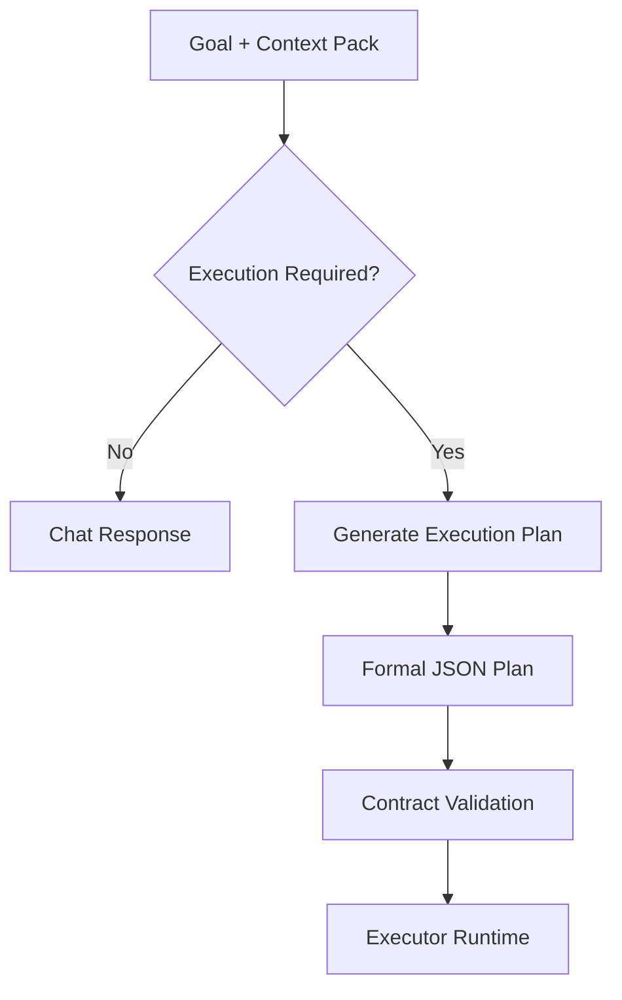
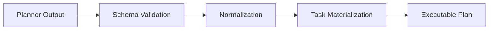
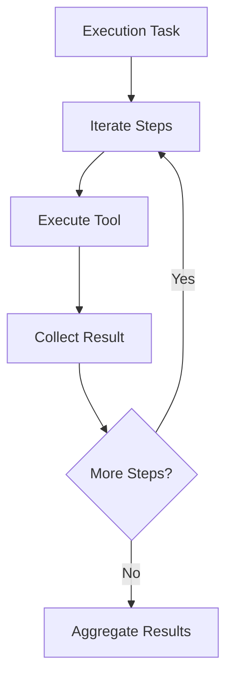
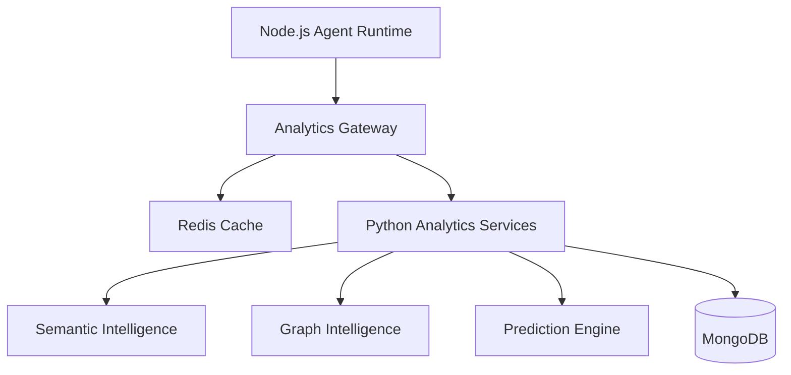
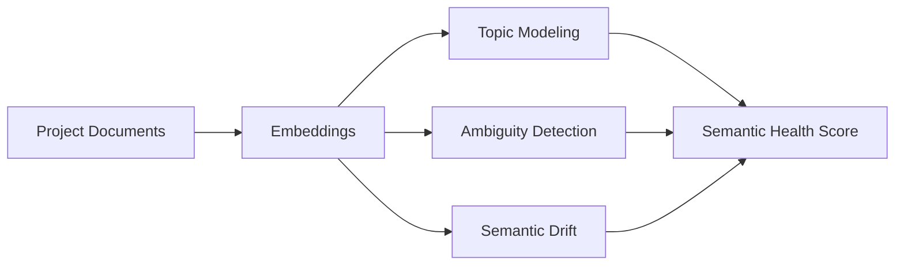
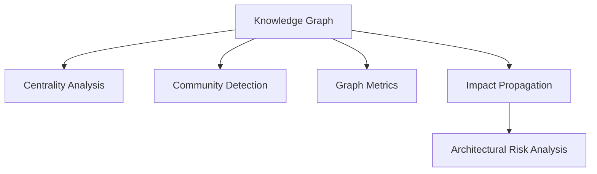
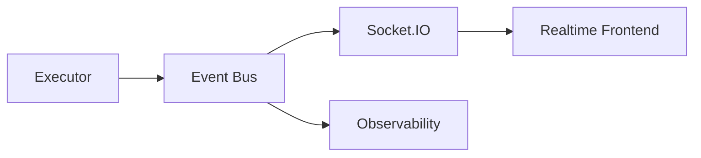

# ReqTracker

Aplicación web para la especificación y seguimiento de análisis de requisitos de software. Permite gestionar proyectos, definir símbolos/entidades del dominio y realizar comparaciones semánticas entre ellos asistidas por inteligencia artificial.

---

## Arquitectura

ReqTracker está compuesto por tres servicios independientes desplegados en [Render](https://render.com), todos contenerizados con Docker:

```
┌─────────────────┐        ┌─────────────────┐        ┌─────────────────┐
│    Frontend     │──────▶ │    Backend      │──────▶ │    Analytics    │
│  React + Vite   │        │ Node + Express  │        │     Python      │
│  Static Site    │        │   Web Service   │        │   Web Service   │
└─────────────────┘        └────────┬────────┘        └─────────────────┘
                                    │
                           ┌────────▼────────┐
                           │    MongoDB      │
                           │  (Atlas / ext.) │
                           └─────────────────┘
```

### Servicios

**Frontend** — React + Vite + Bootstrap
Interfaz de usuario servida como sitio estático. Se comunica exclusivamente con el backend a través de la variable `VITE_API_BASE`.

**Backend** — Node.js + Express
API REST principal. Gestiona autenticación, lógica de negocio, persistencia en MongoDB y actúa como gateway hacia el servicio de analytics. Soporta autenticación con JWT y Google OAuth.

**Analytics** — Python (Web Service)
Microservicio independiente encargado del análisis semántico entre entidades/símbolos del dominio. El backend lo consume a través de la ruta `/api/analytics/compare-entities`. Opcionalmente soporta Redis como caché o cola de tareas.

### Persistencia externa

- **MongoDB** — Base de datos principal (recomendado: MongoDB Atlas en producción).
- **Redis** *(opcional)* — Caché para el servicio de analytics (recomendado: Redis gestionado en producción).

---

## Features

### Gestión de proyectos y requisitos
- Creación, edición y eliminación de proyectos.
- Gestión de símbolos/entidades del dominio por proyecto (CRUD completo).
- Organización y seguimiento del análisis de requisitos por proyecto.

### Autenticación y seguridad
- Autenticación con JWT (registro e inicio de sesión).
- Login con Google OAuth.
- CORS configurado por entorno mediante `FRONTEND_ORIGIN`.

### Analytics e inteligencia artificial
- Comparación semántica entre entidades del dominio a través del microservicio de analytics.
- Integración con **OpenAI** (`gpt-4o-mini` por defecto) y **OpenRouter** como proveedor alternativo de LLMs.

### Infraestructura y despliegue
- Arquitectura de microservicios contenerizada con Docker.
- `docker-compose.yml` para desarrollo y pruebas locales.
- `render.yaml` para definición de infraestructura como código en Render.
- Auto-deploy activado en Render al hacer push a `main`.

---

## Ejecución local

1. Copiá `backend/.env.example` a `backend/.env` y completá las variables necesarias (ver sección siguiente).
2. Levantá todos los servicios con Docker Compose:
   ```bash
   docker compose up --build
   ```
3. Accedé a los servicios:
   - Frontend: `http://localhost:5173`
   - Backend: `http://localhost:3000`
   - Analytics: `http://localhost:8000`

---

## Variables de entorno

### Backend (`backend/.env`)

| Variable | Descripción |
|---|---|
| `MONGO_URI` | URI de conexión a MongoDB |
| `JWT_SECRET` | Clave secreta para firmar tokens JWT |
| `BASE_URL` | URL pública del backend |
| `FRONTEND_URL` | URL pública del frontend |
| `FRONTEND_ORIGIN` | Origen permitido para CORS |
| `ANALYTICS_URL` | URL del servicio de analytics |
| `OPENAI_API_KEY` | Clave de API de OpenAI *(opcional)* |
| `OPENAI_MODEL` | Modelo a usar, ej. `gpt-4o-mini` *(opcional)* |
| `OPENROUTER_API_KEY` | Clave de API de OpenRouter *(opcional)* |
| `OPENROUTER_MODEL` | Modelo a usar vía OpenRouter *(opcional)* |
| `OPENROUTER_API_BASE_URL` | URL base de OpenRouter |
| `OPENROUTER_REFERER` | Referer para OpenRouter |

### Frontend

| Variable | Descripción |
|---|---|
| `VITE_API_BASE` | URL pública del backend (sin `/api`) |

### Analytics

| Variable | Descripción |
|---|---|
| `REDIS_URL` | URL de Redis *(opcional)* |
| `PYTHONUNBUFFERED` | Recomendado: `1` |

---

## API — Rutas principales

### Proyectos
- `GET /api/projects` — Listar proyectos
- `POST /api/projects` — Crear proyecto
- `GET /api/projects/:projectId` — Detalle de un proyecto

### Símbolos
- `GET /api/projects/:projectId/symbols` — Listar símbolos
- `POST /api/projects/:projectId/symbols` — Crear símbolo
- `PUT /api/projects/:projectId/symbols/:symbolId` — Actualizar símbolo
- `DELETE /api/projects/:projectId/symbols/:symbolId` — Eliminar símbolo

### Analytics
- `POST /api/analytics/compare-entities` — Comparación semántica entre entidades

### Auth
- `POST /api/auth/...` — Registro / login JWT
- `GET /api/auth/google/callback` — Callback de Google OAuth

---

## Acerca de la Arquitectura del agente

Plataforma agentic orientada a ingeniería de requisitos y análisis arquitectónico basada en grafos de conocimiento, planificación determinística y analytics semántico-estructural.

La arquitectura combina:

* **LLM Orchestration**
* **Knowledge Graph Reasoning**
* **Semantic Compression**
* **Deterministic Planning**
* **Graph Analytics**
* **Predictive Intelligence**
* **Distributed Analytics Services**

---

# 🚀 Arquitectura General



---

# 🏗️ Core Agent Pipeline

## 1. Context Compiler

Reduce el universo completo del proyecto a un subconjunto relevante antes del razonamiento LLM.

### Objetivos

* evitar token explosion
* reducir ruido semántico
* mejorar determinismo
* seleccionar nodos críticos

### Estrategia de Scoring

| Signal                | Weight |
| --------------------- | ------ |
| Semantic relevance    | 40%    |
| Structural centrality | 30%    |
| Recency               | 15%    |
| Domain heuristics     | 15%    |

---

## Workflow — Context Compression



---

# 🧠 Unified Planner

El planner opera sobre contexto comprimido y genera planes formales ejecutables.

## Responsabilidades

* detectar intención
* decidir modo CHAT/EXECUTE
* generar execution plans
* seleccionar tools
* producir reasoning estructurado

---

## Planner Workflow



---

# 🔒 Contract Enforcement Layer

Valida y normaliza la salida del planner antes de ejecutar.

## Garantías

* schema validation
* deterministic structure
* executable task generation
* malformed-plan prevention

---

## Contract Validation Flow



---

# ⚙️ Executor Runtime

Runtime puro de ejecución.

El executor **no razona**.

## Responsabilidades

* ejecutar tools
* manejar steps
* agregar resultados
* emitir eventos
* consolidar outputs

---

## Execution Flow



---

# 🕸️ Knowledge Graph Architecture

La plataforma opera sobre un grafo de conocimiento especializado en ingeniería de requisitos.

## Entidades principales

* Requirements
* Symbols
* Scenarios
* Relations
* Dependencies
* Analytics Snapshots
* Predictions
* Semantic Clusters

---

## Capacidades sobre el grafo

* dependencias transitivas
* impacto de cambios
* detección de ciclos
* clustering semántico
* criticidad estructural
* propagación de impacto
* análisis de consistencia
* detección de drift conceptual

---

# 📊 Distributed Analytics Architecture

La capa analytics desacopla procesamiento pesado mediante servicios Python especializados.



---

# 🧬 Semantic Intelligence Layer

Servicios NLP especializados.

## Capacidades

* semantic health
* ambiguity detection
* topic extraction
* semantic drift detection
* redundancy analysis

## Stack

* spaCy
* sentence-transformers
* BERTopic
* sklearn

---

## Semantic Analysis Flow



---

# 📈 Graph Intelligence Layer

Análisis estructural avanzado sobre el knowledge graph.

## Capacidades

* PageRank
* Betweenness Centrality
* Community Detection
* Graph Metrics
* Impact Propagation
* Structural Risk Analysis

## Stack

* NetworkX
* python-igraph
* Louvain clustering

---

## Graph Analytics Workflow



---

# 🔮 Prediction Engine

Capa predictiva basada en ML y análisis estructural.

## Capacidades

* risk scoring
* missing relations prediction
* missing requirements inference
* inconsistency forecasting

## Tecnologías

* LightGBM
* XGBoost
* Pattern-based inference

---

# 📡 Realtime Event Architecture

Sistema reactivo basado en eventos.

## Eventos

* `analytics:update`
* `graph:recomputed`
* `prediction:generated`
* `semantic:drift`
* `risk:detected`

---

## Event Flow



---

# 🛡️ Reliability & Resilience

## Implementado

* Circuit Breakers
* Retry Logic
* Adaptive Timeouts
* Graceful Degradation
* Redis Caching
* Structured Logging
* Distributed Tracing

---

# 📦 Stack Tecnológico

## Backend

* Node.js
* Express
* MongoDB
* Redis
* Socket.IO

## AI / NLP

* OpenAI
* spaCy
* sentence-transformers
* BERTopic

## Graph Analytics

* NetworkX
* python-igraph
* Node2Vec

## ML / Prediction

* sklearn
* LightGBM
* XGBoost

---

# 🎯 Arquitectura Resultante

La plataforma evolucionó desde un chatbot con tools hacia una:

## **Agentic Knowledge Intelligence Platform**

Con capacidades de:

* multi-stage reasoning
* graph-aware cognition
* deterministic planning
* semantic compression
* distributed analytics
* predictive intelligence
* architectural reasoning
* realtime observability

---

# ✅ Características Clave

| Capability                | Status |
| ------------------------- | ------ |
| Context Compression       | ✅      |
| Deterministic Planning    | ✅      |
| Knowledge Graph Reasoning | ✅      |
| Semantic Analytics        | ✅      |
| Graph Intelligence        | ✅      |
| Prediction Engine         | ✅      |
| Distributed Analytics     | ✅      |
| Realtime Events           | ✅      |
| Contract Validation       | ✅      |
| Tool Orchestration        | ✅      |

---

El sistemafunciona como:

```text
Cognitive Engineering Intelligence Platform
```

capaz de:

* comprender estructuras complejas
* razonar sobre relaciones
* ejecutar planes determinísticos
* analizar arquitecturas
* detectar riesgos
* inferir inconsistencias
* operar sobre grafos semánticos
* generar inteligencia accionable en tiempo real.
